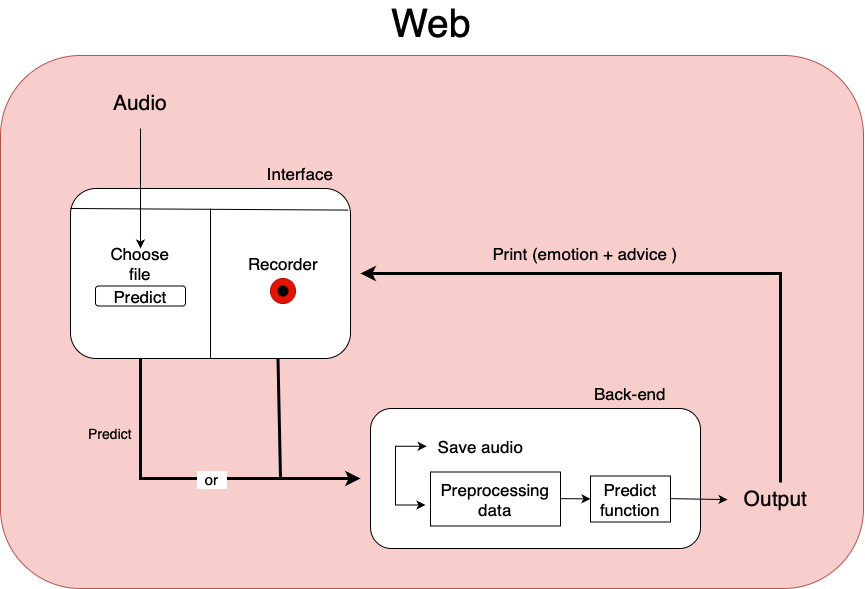

# SER using CNNs and transformers
## Introduction

This project focuses on analyzing the emotions embedded in audio and providing users with alerts regarding the detected emotions. The main objective is to apply the model to analyze the emotions conveyed in the conversations of customer service representatives, enabling the evaluation of customer emotions based on their speech patterns. The insights gained from this analysis can be utilized to enhance the customer care system.

## [Dataset](Data)
### [IEMOCAP](https://www.kaggle.com/datasets/jamaliasultanajisha/iemocap-full)
The project utilizes the IEMOCAP dataset for training and evaluating the speech emotion recognition model. This dataset provides a diverse collection of audio samples with labeled emotional content, allowing for comprehensive training and valdating of the model. [See more](Data/Data_Report.pdf)

To facilitate the model training process, preprocessing the data and identifying factors that impact the model's accuracy is crucial.The data
preprocessing process in any project typically includes the following steps:
1. Aggregate all the necessary features into one CSV file (name, label(one-hot), dimension, path)
2. Extract MFCCs
3. Normalize dataset (Data is bias toward "neutral" label)
4. Train_valid split (test on real data)
   

In parallel with the data processing, we conducted Exploratory Data Analysis (EDA) in both the Python programming language and the EDA software, as required by the course curriculum. See more [EDA.ipynb](Data/EDA.ipynb), [EDA.R](Data/EDA.R)

### Real data
With real-world data, we recorded and manually labeled approximately 306 samples in English and 306 samples in Vietnamese to test the model's objectivity.

Data source: https://www.kaggle.com/datasets/jamaliasultanajisha/iemocap-full

Real data source: 
## [Model](Model)
Our model employs two CNN networks and one transformer encoder model running concurrently.

## [Performance Evaluation]()

## [Web](Web)

## Contributors
1. Hoàng Ngọc Xuân Nguyên
2. Nguyễn Lê Bảo Xuyên
3. Huỳnh Đức Tính
4. Nguyễn Việt Anh
5. Trần Thống Nhất
6. Nguyễn Ngọc Chiến
## Reference

